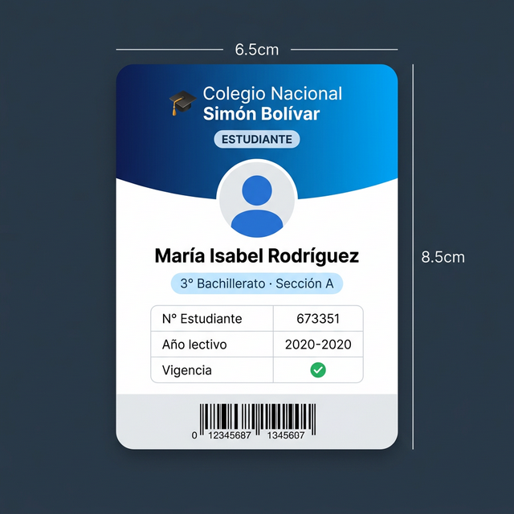
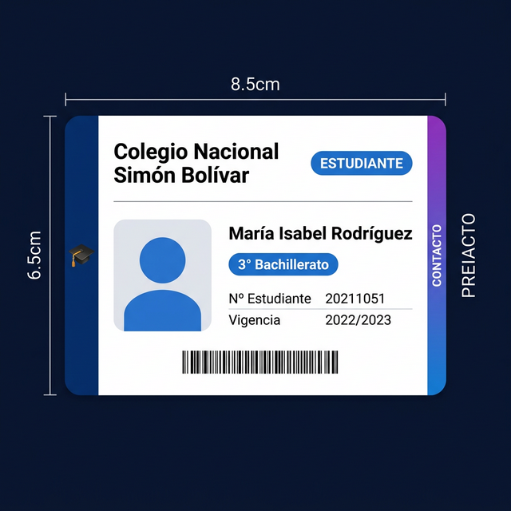
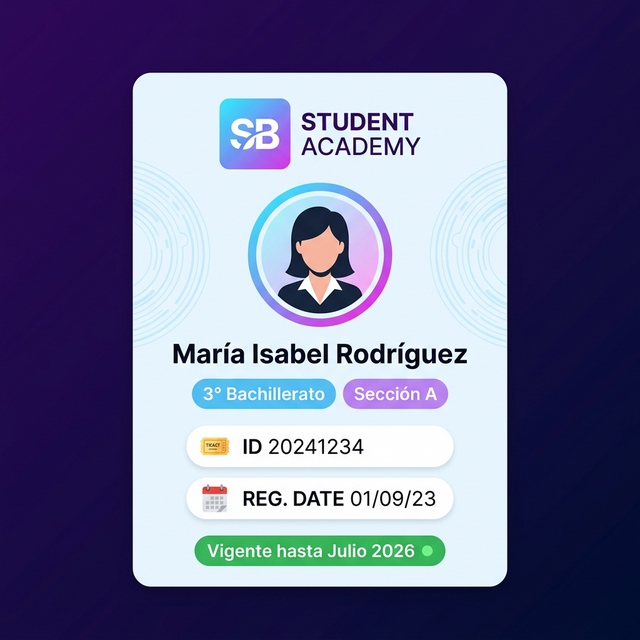

# 🎓 Plantillas de Carnet Estudiantil

Colección de **3 plantillas** de carnet estudiantil para el Colegio Nacional Simón Bolívar, desarrolladas con **HTML, CSS y Tailwind CSS**. Cada plantilla incluye cara frontal y trasera con animación de volteo 3D al hacer clic.

---

## 📁 Estructura del Proyecto

```
carnet/
├── index.html           ← Página principal con acceso a las 3 plantillas
├── assets/              ← Imágenes de previsualización
├── prueba/              ← Plantilla 1: Vertical
│   ├── index.html
│   └── style.css
├── plantilla2/          ← Plantilla 2: Horizontal
│   ├── index.html
│   └── style.css
└── plantilla3/          ← Plantilla 3: Diseño Libre
    ├── index.html
    └── style.css
```

---

## 🖼️ Vista Previa

### Plantilla 1 — Vertical Clásico
> `prueba/index.html` · **6.5 × 8.5 cm**



- ✅ Header azul con gradiente y logo institucional
- ✅ Foto circular del estudiante con borde blanco
- ✅ Tabla de datos: N° estudiante, año lectivo, vigencia
- ✅ Código de barras en el pie
- 🔄 Reverso: WhatsApp, contacto de emergencia y dirección

---

### Plantilla 2 — Horizontal
> `plantilla2/index.html` · **8.5 × 6.5 cm**



- ✅ Orientación apaisada (landscape)
- ✅ Banda lateral izquierda azul con año lectivo
- ✅ Foto rectangular con esquinas redondeadas
- ✅ Layout foto + datos en fila horizontal
- ✅ Código de barras en el pie del cuerpo
- 🔄 Reverso: banda decorativa + 3 tarjetas de contacto

---

### Plantilla 3 — Diseño Libre (Sky + Purple)
> `plantilla3/index.html` · **6.5 × 8.5 cm**



- ✅ Fondo sky blue suave con decoración circular
- ✅ Logo cuadrado con gradiente sky→purple (iniciales "SB")
- ✅ Foto circular con anillo degradado multicolor
- ✅ Etiquetas de grado y sección en colores
- ✅ Chips modernos de datos con íconos emoji
- ✅ Indicador de vigencia verde pulsante
- 🔄 Reverso oscuro (dark navy) con QR decorativo y puntos de color

---

## 🚀 Cómo usar

1. Abre `index.html` (raíz) en tu navegador
2. Haz clic en la plantilla que quieras ver
3. **Haz clic sobre el carnet** para voltearlo y ver el reverso

> 💡 Recomendado: usar la extensión **Live Server** de VS Code para recargar automáticamente al editar.

---

## 📐 Dimensiones físicas

| Plantilla | Orientación | Ancho | Alto |
|-----------|-------------|-------|------|
| 1 · Vertical | Portrait | 6.5 cm | 8.5 cm |
| 2 · Horizontal | Landscape | 8.5 cm | 6.5 cm |
| 3 · Libre | Portrait | 6.5 cm | 8.5 cm |

> Tamaño en pantalla calculado a **96 dpi** (estándar de pantalla).

---

## 🛠️ Tecnologías

- **HTML5** semántico
- **CSS3** — Flexbox, animaciones 3D (`transform-style: preserve-3d`)
- **Tailwind CSS** (via CDN)
- **Google Fonts** — Inter, Space Grotesk

---

## 📋 Contenido de cada carnet

### Cara frontal
| Campo | Valor de ejemplo |
|-------|-----------------|
| Institución | Colegio Nacional Simón Bolívar |
| Nombre | María Isabel Rodríguez |
| Nivel | 3° Bachillerato · Sección A |
| N° Estudiante | CSB-2025-084 |
| Año lectivo | 2025 – 2026 |
| Vigencia | Julio 2026 |

### Cara trasera
| Campo | Valor de ejemplo |
|-------|-----------------|
| WhatsApp apoderado | +593 99 123 4567 |
| Contacto de emergencia | Ana Rodríguez · Mamá |
| Teléfono emergencia | +593 98 765 4321 |
| Dirección | Av. Los Álamos N23-45, Quito |
| Secretaría | (02) 234-5678 |
